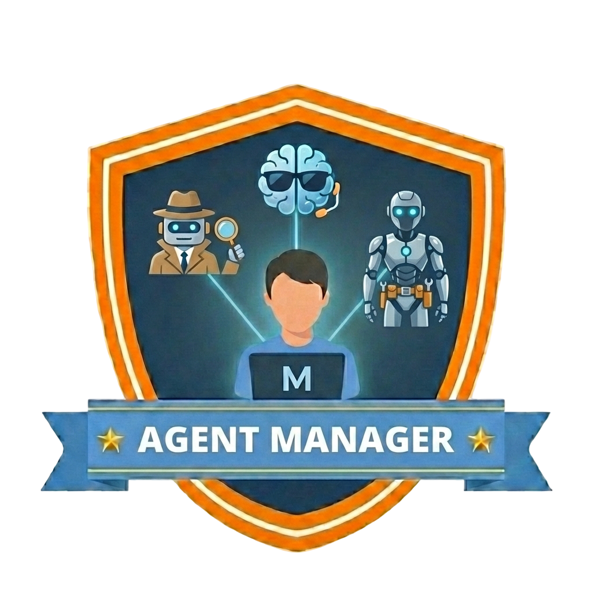
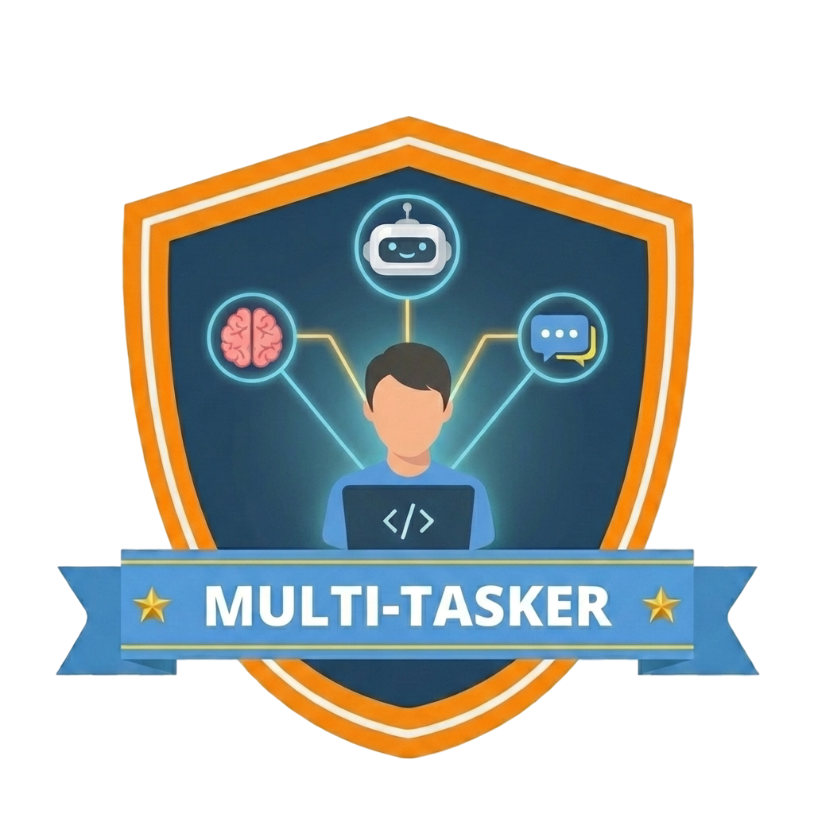
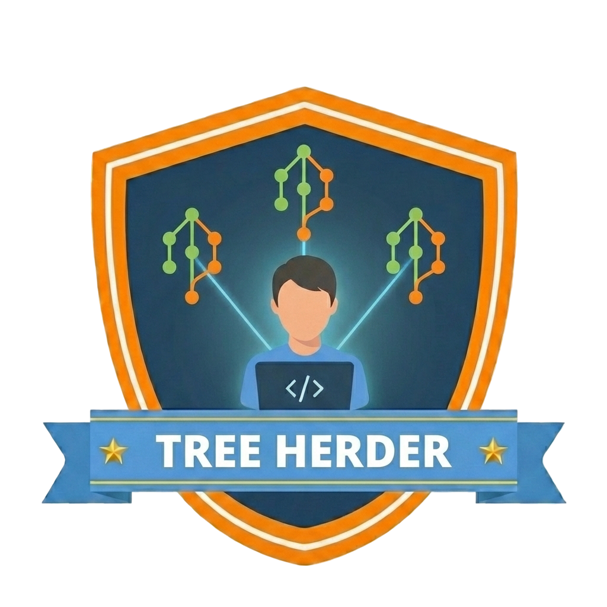
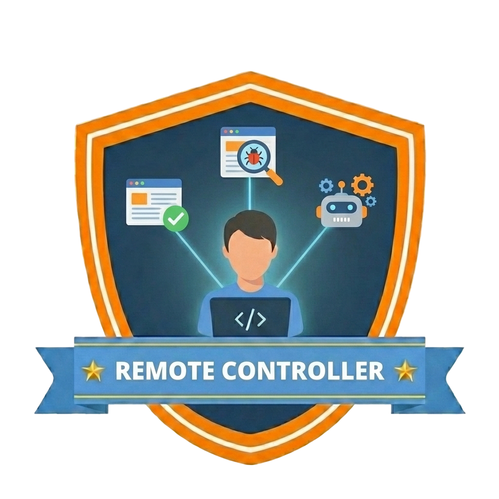
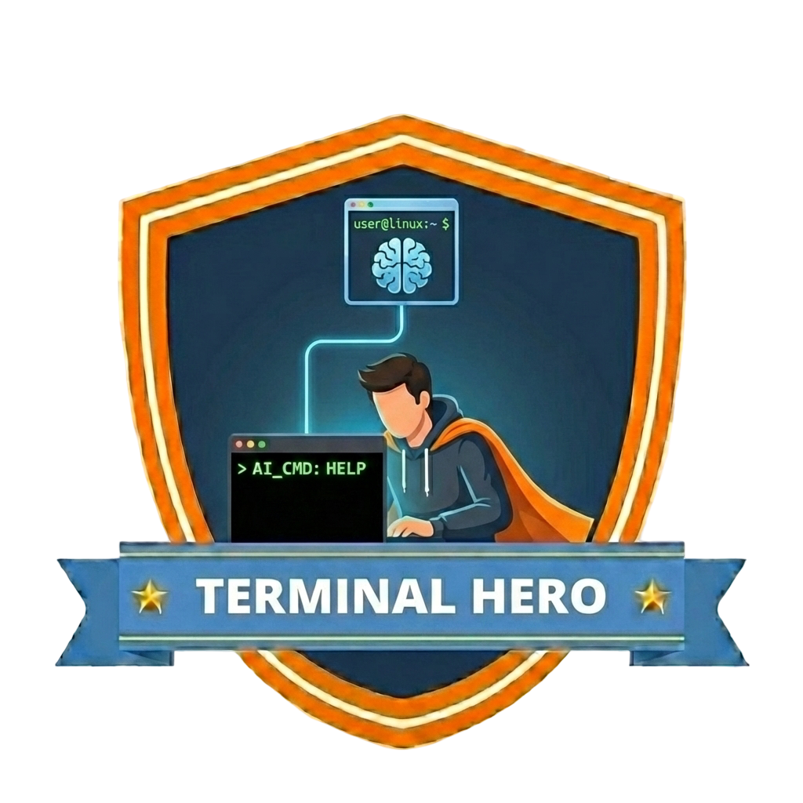

# Vault Run - AI Coding Hackathon

## The Challenge

Stop fixing bugs. Stop maintaining legacy code. Today, you build something from scratch - and you let a frontier AI model do the heavy lifting.

**Vault Run** is a board game about running a cash transport company. Players move around a board, buy contracts, pick up and deliver cash, and try to outsmart their rivals. Your job: turn this game concept into working software, driven almost entirely by AI-generated code.

This is a spec-driven development exercise. Give the AI a spec, guide it when it gets stuck, and see how far you can push it in a single day.

## How It Works

1. **Explore the starter resources** (see below) — understand the game rules, board layout, and data formats
2. **Define your personal challenge** — pick a scope that excites you (see ideas below)
3. **Build it with AI** — use spec-driven development: describe what you want, let the AI write the code
4. **Hands off the keyboard (mostly)** — fixing small bugs or nudging the AI when it is stuck is fine, but try to avoid hand-writing code yourself

## Rules of Engagement

- **Let the AI write the code.** Describe what you want in natural language. Paste specs, rules, and data files into context. Iterate on the output.
- **Fixing bugs is fair game.** If the AI generates something broken and a quick manual fix is faster than re-prompting, go for it.
- **Guiding the AI is encouraged.** Refine prompts, break tasks into smaller pieces, provide examples — that is the skill you are practicing today.
- **Hand-writing large chunks of code defeats the purpose.** The goal is to experience how far AI-driven development can take you in a single session.

## Teamwork

Work in **teams of two**. Start with **pair programming**: share a screen, explore the starter resources, and align on your approach. Once you have a plan and initial structure, switch to **independent work**. That forces you to use GitHub for real: create branches, push code, handle merges, and resolve conflicts.

## Set Up Your Agentic Loop

Before you start coding, set up a proper agentic development workflow. It will matter more than any framework choice.

Your AI tool should be able to write code, run it, read terminal output, fix errors, and iterate without copy-pasting between windows. Set up linting, formatting, and test commands so the agent can validate its own work. Write an `AGENTS.md` and create AI skills with project context, conventions, and instructions so the agent stays on track.

Run multiple agents in parallel on independent tasks. If you are unfamiliar with **Git Worktrees**, this is a good time to learn: they let multiple agents work on the same repo without stepping on each other's toes.

## Topics to Explore

If you want to get more out of AI-assisted development, investigate these topics on your own:

- `AGENTS.md / CLAUDE.md`
- Agent Skills
- Custom Agents
- Isolated Subagents
- Git Worktrees
- Spec-Driven Development
- Prompt Decomposition
- Context Management
- Agentic Feedback Loops
- Verification-First Development

## Starter Resources

| File                                                           | Description                                                          |
| -------------------------------------------------------------- | -------------------------------------------------------------------- |
| [`rules.md`](rules.md)                                         | Complete game rules — the single source of truth for game logic      |
| [`fields.json`](fields.json)                                   | Board layout: 20 fields in order (start, contracts, chance, corners) |
| [`fields-schema.json`](fields-schema.json)                     | JSON Schema for the board data                                       |
| [`chance-card.json`](chance-card.json)                         | All 30 chance cards with their effects and parameters                |
| [`chance-card-schema.json`](chance-card-schema.json)           | JSON Schema for the chance card data                                 |
| [`vault-run-board.svg`](vault-run-board.svg)                   | Visual board layout (SVG for browsers)                               |
| [`vault-run-board-inkscape.svg`](vault-run-board-inkscape.svg) | Visual board layout (portable SVG for Inkscape/GIMP)                 |
| [`vault-run-board-inkscape.png`](vault-run-board-inkscape.png) | Visual board layout (PNG)                                            |
| [`vault-run-board-measured.svg`](vault-run-board-measured.svg) | Board with dimension annotations (SVG for browsers)                  |
| [`vault-run-board-measured-inkscape.svg`](vault-run-board-measured-inkscape.svg) | Board with dimension annotations (portable SVG)    |
| [`vault-run-board-measured-inkscape.png`](vault-run-board-measured-inkscape.png) | Board with dimension annotations (PNG)             |
| [`player.svg`](player.svg)                                     | Player token (35px diameter)                                         |
| [`generate-board.js`](generate-board.js)                       | Node.js script that generates the SVG files                          |

## Make It Your Own

There is no single "correct" project. Pick a challenge that matches your skills and interests:

* **Full-stack dev?** Build the complete game with a backend (game state, rules engine, turn management) and a frontend (animated board, drag-and-drop, turn UI).
* **Backend-focused?** Implement the full game logic with a CLI. Players type commands, the terminal shows the board state. No graphics needed.
* **Into networking?** Create a multiplayer version where players connect from different machines. Use a central server or go peer-to-peer. Handle synchronization, disconnects, and cheating prevention.
* **Frontend enthusiast?** Take the SVG board and bring it to life. Animate dice rolls, token movement, and contract purchases. Wire it up to a mock backend or local game state.
* **AI/ML curious?** Build a bot that plays Vault Run. Implement different strategies and pit them against each other.
* **Mobile dev?** Build a native or cross-platform mobile version of the game.

The only rule: **start by understanding the starter resources, then define your own scope.**

## Sample Focus Areas

Not sure where to start? These guides describe three different focus areas with concrete sprint plans:

| Guide | Who it is for |
|---|---|
| [Game Logic + CLI](sample-focus-1.md) | Backend developers who prefer clean logic over pixels |
| [Multiplayer with Security](sample-focus-2.md) | Network engineers and distributed systems enthusiasts |
| [Interactive Board UI](sample-focus-3.md) | Frontend developers who want to build something visual |

## Build Step by Step

> **Don't try to build the entire game in one go.**

Work in **mini-sprints**: aim for working software roughly every hour. Each sprint should add one layer of functionality on top of the last. This way you always have something that runs. If time runs out, you still have a working subset of the game instead of a half-finished whole.

## Tech Stack

Use whatever you want:

- **Language** - your call
- **UI** - Web, terminal, desktop, mobile
- **Testing** - pick your favorite testing framework
- **Editor** - VS Code, VS, vim — whatever gives you the best AI-assisted workflow

Picking a tech stack you do not know well is fine, even encouraged. The AI is doing most of the typing. If you have wanted to try Rust, Go, or Svelte, this is a good opportunity to learn by reviewing and guiding the output.

## Badges

There is no prize ceremony and no leaderboard, but there are badges. If you pull off one of the techniques below, award it to yourself. These are harder than they sound.

| Badge | How to earn it |
|---|---|
|  | **Agent Manager** — Delegate a non-trivial task to an AI agent using a carefully crafted, multi-step prompt. Not "write a function" — think "implement the full contract-purchasing flow including validation, state updates, and error handling". |
|  | **Multi-Tasker** — Run two or more AI agents at the same time, each tackling a different part of the project. Game logic on one side, UI on the other — simultaneously. |
|  | **Tree Herder** — Use Git Worktrees to let multiple agents work on the same repository in parallel without conflicts. If you have never used worktrees before, this one will change how you think about parallel development. |
|  | **Remote Controller** — Have an AI agent drive end-to-end UI tests: open a browser, interact with your app, and verify the results — all without you touching the mouse. |
|  | **Terminal Hero** — Run an AI agent directly in the terminal. No GUI, no IDE plugin — just the shell, the model, and your prompts. |

These badges are self-awarded. Nobody is checking. But if you earn one, you will know.

## Why This Exercise?

Curious why Vault Run works well for practicing AI-assisted development? Read **[Why Vault Run?](why-vault-run.md)** — a breakdown of what makes this project effective for teaching and learning.

## Licensing

The sample specification and artwork in this repository are licensed under
**CC BY-NC 4.0**. See [`LICENSE-CONTENT`](LICENSE-CONTENT).

The code in this repository is licensed under **MIT**. See [`LICENSE`](LICENSE).
